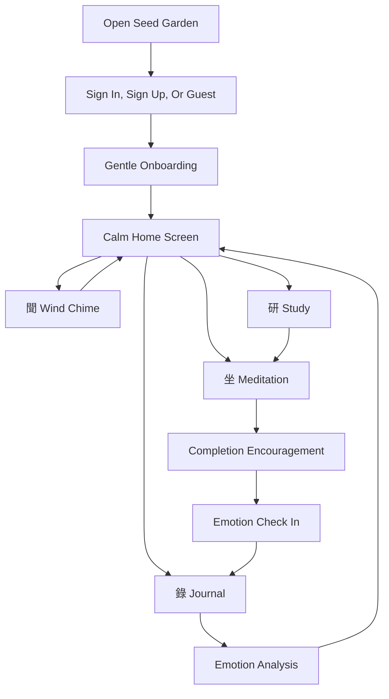

# Seed Garden Workflow And Use Cases

## Product Summary

Seed Garden is a gentle meditation and emotional support app. Based on the Figma screens, the product combines meditation, journaling, emotion tracking, learning, and calming sensory rituals into one quiet mobile experience.

The app should feel less like a productivity tracker and more like a digital garden for emotional recovery: calm, poetic, reflective, and low-pressure.

## Target User Needs

### 1. Emotional Grounding

Users may arrive feeling anxious, distracted, tired, lonely, or emotionally overwhelmed. They need a simple way to settle down without too many choices.

Suggested response:
- Offer a calm home screen with minimal visual noise.
- Make the primary action easy: start a meditation, journal, or listen to a wind chime.
- Avoid aggressive streak or productivity language.

### 2. Guided Self-Awareness

The onboarding screens ask users about mindfulness goals and routine challenges. This suggests users need help understanding why they are practicing and what makes consistency difficult.

Suggested response:
- Ask a small number of onboarding questions.
- Use chip-based answers instead of long forms.
- Personalize meditation suggestions and reminders from the answers.

### 3. Routine And Consistency

The Figma includes meditation duration, total meditation time, streaks, and “83 people is meditating with you.” Users need gentle motivation and a sense that they are not alone.

Suggested response:
- Show meditation progress softly.
- Use social presence as comfort, not competition.
- Celebrate completion with encouraging language.

### 4. Reflection And Emotional Processing

The notebook screens connect meditation sessions with notes and emotion icons. Users need a space to name feelings and observe changes over time.

Suggested response:
- Prompt users to record mood after meditation.
- Allow short journal entries.
- Link journal entries to meditation duration and date.

### 5. Calm Learning

The study screens include topics like meditation benefits, posture, breathing, home Zen space, and Zen culture. Users need learning content that supports practice.

Suggested response:
- Keep lessons short and practical.
- Group content by beginner, advanced, and culture.
- Link articles back to a recommended meditation action.

### 6. Quick Comfort

The wind chime screen suggests a feature for users who want a calming moment without starting a full meditation session.

Suggested response:
- Offer wind chime as a quick calming ritual.
- Add optional sound control.
- Consider using time, weather, or wind data later to make the feature feel alive.

## Core Figma Elements

### Home

Relevant Figma elements:
- Greeting: `Good evening, 觀石者`
- Vertical poem
- Four circular actions: `坐`, `錄`, `聞`, `研`
- Small mascot/emotion character

Purpose:
The home screen should be the emotional anchor. It invites the user into a quiet space and gives four simple paths.

Suggested actions:
- `坐`: meditation
- `錄`: journal / record
- `聞`: wind chime / ambient calming
- `研`: study / learning

### Sign Up And Sign In

Relevant Figma elements:
- Email and password fields
- Continue with Google
- Continue with Apple
- Continue as guest

Purpose:
Entry should be low friction. Since this is an emotional support product, users should not be forced to create an account before they experience calm.

Suggested workflow:
1. User lands on welcome or sign-in screen.
2. User can sign up, sign in, or continue as guest.
3. Guest mode gives access to core calming features.
4. Account mode enables saved journals, emotion history, and progress tracking.

### Onboarding

Relevant Figma elements:
- “Before we get started, tell me a little about you”
- “What is your primary goal for practicing mindfulness?”
- Routine challenge questions
- Chip components

Purpose:
Onboarding should understand the user’s emotional goal and practice barriers.

Suggested workflow:
1. Ask the user’s primary mindfulness goal.
2. Ask what makes routine difficult.
3. Ask preferred meditation duration or time of day.
4. Use answers to personalize the home screen and suggested practice.

### Meditation

Relevant Figma elements:
- `坐 meditation`
- Duration chips: 15, 30, 45, 60 minutes
- “83 people is meditating with you”
- Day/night scene
- Gold `Start` button
- Completion state: “Peace and stillness is here”

Purpose:
Meditation is the core practice loop.

Suggested workflow:
1. User chooses meditation from home.
2. User selects a duration.
3. User taps `Start`.
4. App shows a quiet timer or meditative scene.
5. When complete, app celebrates gently.
6. App offers optional journal and emotion check-in.

### Journal / Notebook

Relevant Figma elements:
- `禪悅筆記`
- Dated entries
- Meditation duration attached to entries
- Emotion icons
- Long reflection text

Purpose:
Journaling helps users convert a meditation session into emotional insight.

Suggested workflow:
1. User completes meditation or opens journal directly.
2. User selects current emotion.
3. User writes a short note.
4. Entry is saved with date, emotion, and practice duration.
5. User can review previous reflections.

### Emotion Analysis

Relevant Figma elements:
- `情緒分析`
- Weekly emotion chart
- Emotion icons across days
- Total meditation time
- Consecutive meditation days

Purpose:
Emotion tracking helps users notice patterns over time.

Suggested workflow:
1. Journal entries and mood check-ins create emotion data.
2. App shows weekly emotion trend.
3. App highlights supportive insights, such as calmer days after practice.
4. User can view total meditation time and streaks.

### Wind Chime

Relevant Figma elements:
- `聞 Wind chime`
- Wind chime illustration
- Sound icon
- “鈴不自鳴，唯風動而響，隨勢而應”
- Current wind speed

Purpose:
Wind chime is a quick calming ritual and brand differentiator.

Suggested workflow:
1. User chooses `聞` from home.
2. App opens a minimal wind chime scene.
3. User can turn sound on or off.
4. Optional future version uses live wind/weather data.
5. User can return to home or begin meditation.

### Study

Relevant Figma elements:
- `研 study`
- Meditation basics
- Breathing and inner observation
- Home Zen space
- Science and emotional regulation
- Zen culture topics

Purpose:
Study helps users understand why and how meditation supports emotion.

Suggested workflow:
1. User chooses `研` from home.
2. User browses short article cards.
3. User opens an article.
4. Article ends with a recommended practice.
5. User can start meditation or save the article.

## Recommended End-To-End User Workflow

## Suggested Web Showcase Workflow

The responsive webpage should explain the product in a way that investors, collaborators, or early users can understand quickly.

Recommended webpage order:

1. Hero: introduce Seed Garden as a calm emotional support companion.
2. Problem: people need a gentle way to process emotion, not another noisy productivity app.
3. Core rituals: meditate, journal, listen, study.
4. Meditation demo: duration chips, start button, companion count, and mascot.
5. Emotion insight: weekly mood tracking and reflection.
6. Journal: show how feelings become notes.
7. Wind chime and study: show the app’s unique calming and learning features.
8. CTA: invite the user to begin with one quiet moment.

## MVP Feature Recommendation

### MVP 1: Static Web Showcase

Goal:
Explain the product and demonstrate the intended app experience.

Features:
- Responsive landing page
- Figma-inspired phone mockups
- Core ritual sections
- No real login or stored data

### MVP 2: Clickable Prototype

Goal:
Let users click through the core app flow.

Features:
- Home screen
- Meditation duration selection
- Simulated meditation completion
- Emotion check-in
- Journal entry mock flow

### MVP 3: Functional App

Goal:
Support real user practice and emotional reflection.

Features:
- User accounts
- Saved meditation sessions
- Journal storage
- Emotion tracking
- Study content
- Wind chime audio

## Business Recommendations

- Keep guest mode available to reduce friction.
- Treat progress as encouragement, not pressure.
- Use emotion tracking for self-awareness, not diagnosis.
- Keep copy gentle, poetic, and supportive.
- Preserve the Chinese Zen identity as a major differentiator.
- Prioritize mobile because the Figma is clearly designed around phone usage.
- For the web showcase, use desktop layouts to explain the product while keeping mobile app frames as the visual center.
